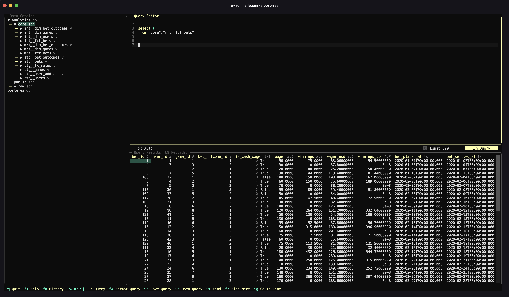

# Submission Notes

Feel free to add anything you would like to this document to help explain your submission. Things like presumptions that you made, other features and best practices that you would implement in a production grade system etc. Some suggested headings are below.

Part 1:
--------------------------
This data pipeline utilizes `watchdog`s osberver to monitor the file path location for csv file creations or modifications. If an creation or modification has been detected the current bets table will be truncated and repopulated.


Logs:
```
2025-04-09 21:27:11,410 - CSVFileDataPipeline - INFO - run - Pipeline started. Watching directory: src/landed_files/
2025-04-09 21:27:26,884 - CSVFileDataPipeline.FileEventHandler - INFO - on_created - File Creation detected: /Users/renepersau/Projects/personal/senior-data-engineer-technical-test/src/landed_files/bets.csv
2025-04-09 21:27:26,928 - CSVFileDataPipeline.FileEventHandler.DatabaseHandler - INFO - execute_query - Executing query: TRUNCATE TABLE raw.bet with params: None
2025-04-09 21:27:27,279 - CSVFileDataPipeline.FileEventHandler.DatabaseHandler - INFO - run - Successfully wrote 69 rows to raw.bet.

```


Part 2:
--------------------------
The dbt setup follows the Kimball principle in dimensional data modeling utilizing dimension and fact tables with dbts staging, intermediate and marts separation accordering to their best practises. Tests have been added to the schema.yml for each stage to capture data quality issues.



## Presumptions Made

Part 1:
--------------------------
- The pipeline currently follows the logic of idempotency where the data input is expected to deliver the same outcome no matter how many times it is running. THerefore the table is being truncated before repopulated. 
- It has been assumed that only a single "bets" csv file is being added to the file location. Additional files do work only if they contain data from previous files, which could cause a problem if the data grows rapidly. 
- It has been assumed that a file deletion has no impact on the data sink.
- We are assuming that files have a consistent schema in terms of columns and data types.


Part 2:
--------------------------
- SCD Type 2 aren't required just yet, but can be implemented in the future utilizing dbt snapshots.
- Data is being modeled based on Kimball to serve data to Data Analysts or non-technical users.


## Additional Production Grade Considerations

Any best practices or anything else that you would consider if this were a production grade solution

Part 1:
--------------------------
- Rewrite docker compose file to separate the `core` service into dbt and pipeline.
- Increase the number of unit tests (currently 40 unit tests implemented) across wider / less essential modules.
- Add data sanitization checks at CSV reader stage.
- Resolve DRY problem currently with watchdog setup (repetition of class usage across creation and modification).
- Implement watchdog execution based on file name to avoid random csvs potentially breaking the application.


Part 2:
--------------------------
- Build out marts layer by gathering more requirements for aggregated tables.


## Setup Changes from initial template 
- Updated make file to use newer docker(-)compose version
- Assigned user to healthcheck to avoid fatal execution
